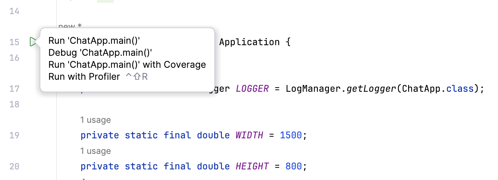
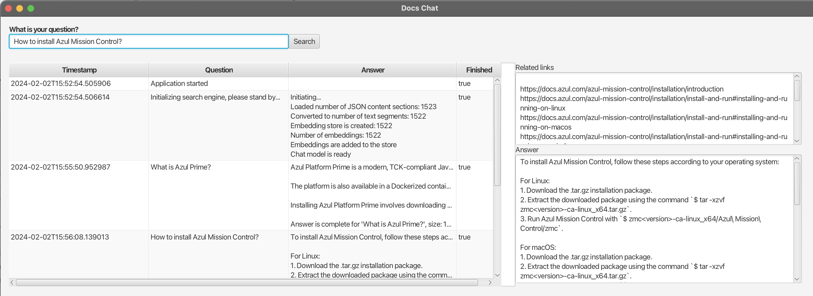

# LangChain4J JavaFX Documentation Chat demo application

This application uses an existing JSON, based on the Azul documentation on [docs.azul.com](https://docs.azul.com), to provide a chat JavaFX user interface.

## Project Setup

* Use a JDK with JavaFX:
```bash
$ sdk install java 21.0.1.fx-zulu
```
* Configure the project in IntelliJIDEA to use this SDK.
* Get an API key from OpenAI and set as environment variable or directly in `ApiKeys.java`.
* Start the main class `ChatApp.java` by hitting run in the IntelliJIDEA.

* Wait until the chat model is ready before asking a question.


